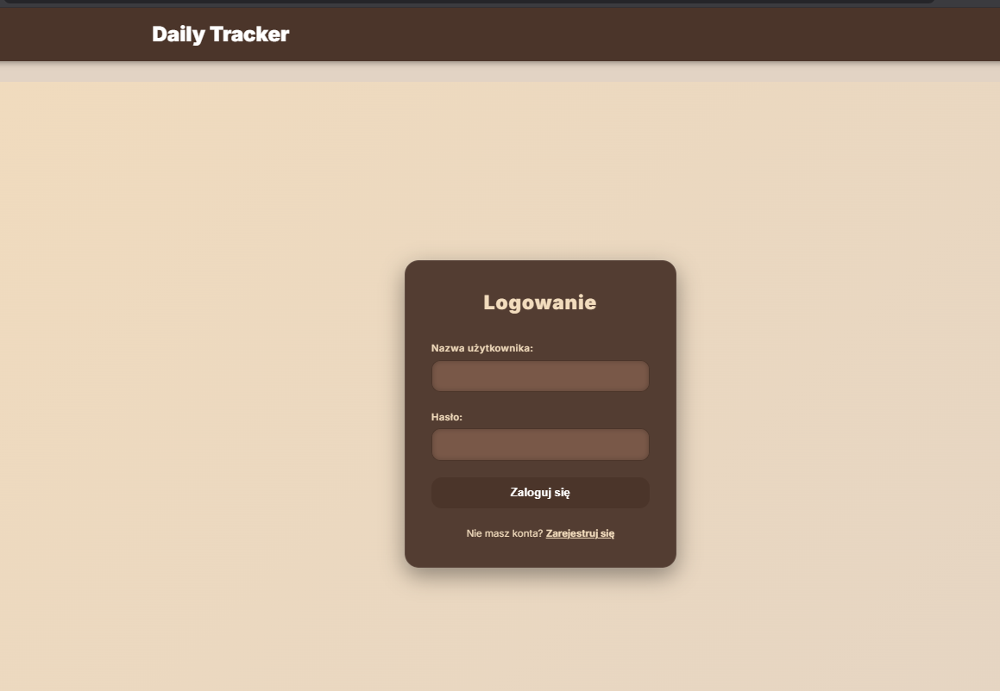

# 📊 Daily Tracker Frontend
> **Status projektu:** 🚧 W budowie / In Progress

Nowoczesny frontend aplikacji do monitorowania codziennych postępów i statystyk życiowych. Aplikacja pozwala na systematyczne zbieranie danych o Twoim dniu, pomagając wyciągać wnioski i budować lepsze nawyki.

---

## 📝 O projekcie
Aplikacja służy jako Twój osobisty dziennik cyfrowy. Zamiast rozproszonych notatek, masz jedno miejsce, w którym lądują Twoje kluczowe metryki.

**Co możesz śledzić?**
* 🚗 **Aktywność:** np. liczba przejechanych kilometrów, kroki, czas treningu.
* ⭐ **Samopoczucie:** ocena dnia w skali 1-10, poziom stresu.
* 🥗 **Nawyki:** czy udało się utrzymać dietę, ilość wypitej wody.
* ✍️ **Refleksje:** krótkie notatki podsumowujące dzień.

## ✨ Kluczowe funkcje (w rozwoju)
- [ ] Interaktywny formularz dodawania wpisów dziennych.
- [ ] Podgląd historycznych statystyk.
- [ ] Wizualizacja danych (wykresy postępów).
- [ ] Responsywny interfejs (Mobile First).

---

## 📸 Podgląd Panelu (Screeny)

  
  

  

  

  
  

  

## 🛠️ Technologia i Setup

Projekt bazuje na **Vue.js** oraz ultraszybkim narzędziu **Vite**.

